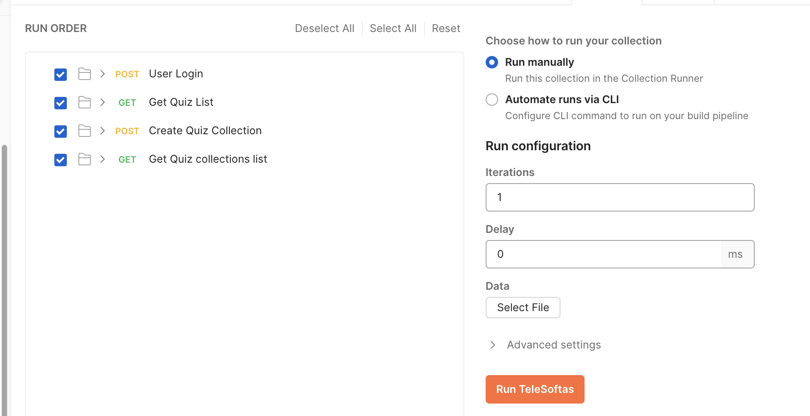

# TeleSoftas Assesment
## Table of Content
----------
- Introduction
- Folder structure
- Task1 Solution
    - Running the Application
- Task2 Solution
- Task3 Solution
    - Side Note
    - Improvements

### Introduction
----------
This repository contains solution to the practical task for QA position at TeleSoftas solutions department.

The Problem statement can be found in the PDF file named `"Task_Spirent_-_Google_Docs.pdf"` in this root folder.
### Folder Structure
----------
- TeleSoftas is the root folder and contains three other subfolders
- Task1, Task2, Task3 are the different subfolders, and the contain solutions to each of the Tasks provided
### Task 1 - Web-UI Testing using Selenium
----------
***Framework***   --> Selenium, unittest

***Language***    --> Python

#### **Running the application**

Navigate to the Task1 Directory

Set up python virtual environment in the Task1 Directory
```
python3 -m venv venv
```
Activate the virtual enviroment
On MacOs or Linux
```
source venv/bin/activate
```
On Windows
```
venv\Scripts\activate.bat
```
Install the necessary dependencies from the `requirements.txt` file
```
pip install -r requirements.txt
```
Add the module to Path
On MacOs
```
export PYTHONPATH="${PYTHONPATH}:/Users/...full path of Task1"
```
On Windows
```
SET PYTHONPATH="%PYTHONPATH%;C://... full path of Task1"
```
Run the test
```
python3 -m unittest -v test/test_tiketa_website.py
```

Result
- The screenshot folder contains sample screenshots taken for every action performed on the web-ui

### Task 2 - Function Debugging
----------
Task two contains two functions
- The original incorrect `print_list()` function, and
- A modified correct version of the `print_list()` function named `print_list_modified()`
- More explanation about each function (why and how they work or don't work) is included as a docstring in each of the function

### Task 3 - API Test Automation using Postman
----------
Running the Postman Test
1. Import the `Task3/TeleSoftas.postman_collection.json` file in Postman
2. Create an environment in Postman and name is `DEV`
3. Add a global variable named `base_url` and set the value to `https://staging-api.quizmart.io/`
4. Click on the `three dotted` icon beside the `TeleSoftas` collection name, and select `Run Collection`
5. Select as much iterations as you want and click `Run TeleSoftas` as shown in the image below




### Side Note:
Endpoints provided for task three were incomplete
- No endpoint provided to create an account
    - Fix: Account was created throught the Web-UI
- Endpoint to Get Quiz list was not provided
    - Fix:
    1. I had to inspect the Web-UI page to see the API request that was being sent by the Web-UI to get all quiz list
    2. I also had to debug that the actual API needed was the get quit list not collection list, as a new user can create a collection by adding quizzes from              the quiz list


